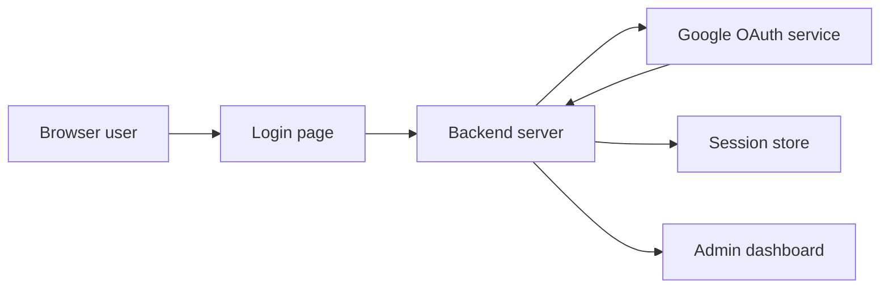

# Chart Generator Google Kilocode

This is a minimal Node.js application demonstrating Google OAuth 2.0 authentication with domain restriction, secure session handling, and a simple admin dashboard.

## Features

- **Login with Google**: Users authenticate via Google OAuth 2.0.
- **Domain enforcement**: Only users from allowed domains (configured in `backend/allowed-domains.json`) may log in.
- **Server‑side sessions**: Uses `express-session` for session management.
- **Error & loading feedback**: Inline error display and loading indicator on the login page.
- **Admin dashboard**: Protected route displaying user profile info and sample data.

## Prerequisites

- Node.js 18+
- Docker & Docker Compose
- Google OAuth 2.0 Client ID & Secret
- Allowed domain (e.g., `si-ware.com`)

## Setup & Installation

1. **Clone the repo**  
   ```bash
   git clone https://github.com/TamerElSherif-Siware/chart_generator_google_kilocode.git
   cd chart_generator_google_kilocode
   ```

2. **Configure environment**  
   Copy the example and fill in your values:
   ```bash
   cp backend/.env.example backend/.env
   ```
   Edit `backend/.env`:
   ```
   GOOGLE_CLIENT_ID=your_google_client_id
   GOOGLE_CLIENT_SECRET=your_google_client_secret
   COOKIE_KEY=some_random_secret
   DB_HOST=...
   DB_USER=...
   DB_PASSWORD=...
   DB_NAME=...
   DB_PORT=5432
   ```

3. **Start the application**  
   ```bash
   cd backend && docker-compose up --build
   ```
   Backend API will listen on port 5001.

4. **Open in browser**  
   Visit: http://localhost:5001/login.html

## Environment Variables

| Variable            | Description                             |
|---------------------|-----------------------------------------|
| GOOGLE_CLIENT_ID    | Google OAuth 2.0 client ID              |
| GOOGLE_CLIENT_SECRET| Google OAuth 2.0 client secret          |
| COOKIE_KEY          | Secret key for session cookies          |
| DB_HOST             | PostgreSQL host                         |
| DB_USER             | PostgreSQL user                         |
| DB_PASSWORD         | PostgreSQL password                     |
| DB_NAME             | PostgreSQL database name                |
| DB_PORT             | PostgreSQL port (default: 5432)         |

## Architecture Diagram



1. **Browser user** loads the **Login page** and clicks “Login with Google.”  
2. The **Backend server** uses Passport + Google OAuth strategy to redirect to **Google OAuth service**.  
3. After consent, Google returns the user’s profile to the **Backend server**, which enforces allowed domains, establishes a **session**, and redirects to the **Admin dashboard**.

## License

MIT